# Job Hunt

Job Hunt is a personal job-search operations system built with Python, LangGraph, LangSmith, and pluggable model/browser adapters.

It is designed to help a candidate track applications, ingest Gmail status updates, evaluate job postings, generate high-quality resume and cover-letter artifacts, and keep a clear audit trail of what happened.

## What To Understand First

The project has one main loop:

```text
find jobs -> evaluate fit -> generate artifacts -> assist application fill
          -> human submits -> record tracker/activity -> reconcile email replies
```

Everything else supports that loop:

- `config/`: runtime configuration examples and local service configuration
- `profile/`: private candidate inputs such as resume text, profile YAML, and Workday answers
- `data/`: local tracker, inboxes, ledgers, and CRM state
- `prompts/`: evaluation, outreach, and strategy prompt templates
- `job_hunt/`: CLI, LangGraph nodes, repositories, and service code
- `docs/`: design notes and agent runbooks

Generated reports, PDFs, screenshots, browser profiles, OAuth tokens, and local
ledgers are private runtime state and are ignored by git.

## Repository Structure

The project separates reusable code from personal runtime data. New contributors
should only need to understand the public directories first:

```text
job_hunt/      Python package: CLI, graph nodes, services, repositories
prompts/       Prompt templates used by evaluation and outreach flows
templates/     HTML/Jinja templates and public static template assets
docs/          Design notes, runbooks, and diagrams
tests/         Unit tests for the public behavior
config/*.example.yml
               Safe example configuration files
```

Local-only files are intentionally grouped by purpose and ignored by git:

```text
profile/       Candidate-owned inputs: profile.yml, cv.md, article-digest.md,
               cv-experience.yml, and Workday employer answers
config/*.yml   Machine/local runtime config copied from the examples
data/          Tracker state, pipeline inbox, ledgers, email/activity logs
reports/       Generated evaluation reports
output/        Generated resumes, cover letters, PDFs, and HTML
artifacts/     Browser screenshots and apply-session evidence
storage/       OAuth tokens, browser profiles, private uploads, local secrets
jds/           Local pasted job descriptions
```

Canonical candidate input paths are fixed:

```text
profile/cv.md
profile/profile.yml
profile/article-digest.md
profile/cv-experience.yml
profile/workday-employers/*.yml
```

The code reads from these locations directly; it does not search legacy profile
paths. This keeps the mental model small and makes open-source safety easier to
audit.

## Closed-Loop Overview

<!-- DIAGRAM:closed-loop -->
<!-- Flowchart of the end-to-end closed loop is generated via an MCP server and embedded as docs/diagrams/closed-loop.svg. See "Diagram authoring" below. Until the asset is generated, the loop is described in text:

  scan → pipeline.md inbox → evaluate (cv-sync-check → JD extract → score → Section G → report.md → cv.pdf → cover-letter.pdf)
       → tracker (write_tracker_addition / TSV staging via tracker_ops)
       → apply (Workday / apply-answers fallback) → manual submit
       → email poll → email reconcile → tracker status update
       → tracker verify / dedup / normalize / check-sync (operational hygiene) -->



The closed loop above renders the full pipeline: discovery (`scan`, `pipeline.md`) →
evaluation (`evaluate` with `cv-sync-check` gate, scoring, Section G draft answers, PDF +
cover letter) → tracking (`applications.md` via direct write or `tracker_ops` TSV
staging) → submission (`apply` fill-only loop with manual final-click) → reconciliation
(`email poll` + `email reconcile`) → hygiene (`tracker verify / dedup / normalize /
check-sync`).

## Architecture

The system is three cooperating subsystems, deliberately kept separate:

1. **Evaluation graph** (`job_hunt/graphs/evaluate_job.py`, `job_hunt/nodes/`) —
   a LangGraph `StateGraph` of ~20 typed, single-purpose async nodes. Given a
   job description it extracts and gates it, classifies the role archetype,
   matches it against the candidate CV, researches the company, scores fit
   across weighted dimensions, and — only when the score clears the bar —
   generates a tailored CV, cover letter, and report. LLM calls go through a
   tiered provider layer (cheap tier for analysis, premium tier for
   generation) with structured outputs and graceful fallback. It is the only
   subsystem that is a LangGraph graph.

2. **Discovery service** (`job_hunt/services/scan.py`) — not a graph. Scans
   direct ATS APIs (Greenhouse / Lever / Ashby), per-company Brave WebSearch,
   and opt-in cross-employer discovery channels, then de-duplicates results
   against the local tracker and scan history.

3. **Application assistant** (`job_hunt/cli/apply.py` apply flow +
   `job_hunt/services/workday/`, `job_hunt/services/linkedin/`,
   `job_hunt/services/web/apply_ipc.py`) — Playwright automation for Workday
   and LinkedIn Easy Apply. It runs a **two-step, fill-only** flow: the browser
   fills known fields and stops at the review screen; a human inspects and
   clicks submit; a separate confirm step records the application. Out-of-band
   commands (replace PDF, capture page, refill) are coordinated through
   file-lock IPC sentinels and a per-session heartbeat, with a structured JSONL
   event log per run. Auto-submit exists but is off by default and sits behind
   multiple gates; the default posture is that nothing is ever submitted
   without an explicit human click.

A single top-level `mode: student | full` switch in `profile.yml` cascades
across discovery filters, scoring weights, and narrative framing, so the same
job produces the appropriate recommendation for the kind of role being hunted.

## Goals

- Keep the workflow human-in-the-loop. The system can draft, fill, and track, but it must not submit applications without explicit user approval.
- Use cheap models for routine extraction, summarization, classification, and tracking.
- Use premium local commands, such as Claude or GPT-5.5 wrappers, for high-stakes resume and cover-letter generation.
- Support LangSmith tracing without depending on it. Local ledgers remain available when LangSmith is disabled.
- Be safe to open source. Real credentials, cookies, OAuth tokens, generated documents, local state, and private ledgers are ignored by git.

## Safety

Before publishing or committing, check:

```bash
git status --short
job-hunt config doctor
git status --ignored --short
```

The `.gitignore` intentionally excludes:

- `.env` and local config files
- `profile/` candidate-owned inputs
- OAuth tokens and browser cookies
- generated PDFs, HTML, reports, and artifacts
- local ledgers and scheduler state
- caches and Playwright traces

For an open-source release, the repository should contain code, templates,
example config, prompts, and docs only. Keep `profile/`,
local `config/*.yml`, `data/*.jsonl`, `reports/`, `output/`, `artifacts/`,
`memory/`, `.claude/`, and `storage/` out of the published tree.

## Quick Start: Start Finding Jobs

```bash
python -m venv .venv
source .venv/bin/activate
pip install -e ".[dev,gmail]"
job-hunt init                  # default: guided onboarding (7-question narrative)
job-hunt import-resume ./resume.pdf
job-hunt configure-ai
job-hunt search --save
job-hunt shortlist
```

The guided onboarding is on by default and asks seven questions about your
"superpower," what energizes/drains you, deal-breakers, best achievement,
portfolio links, and exit story. The answers populate
`profile/profile.yml::narrative` so the evaluator's adaptive framing knows how to
position you. Skip the questionnaire with `--no-guided` or `--yes`.

The first-run path is intentionally small:

1. import a resume into `profile/cv.md`
2. configure the AI provider used for job evaluation
3. scan configured ATS portals and optional Brave WebSearch targets into `data/pipeline.md`
4. review candidates with `job-hunt shortlist`

Optional WebSearch support uses Brave. To enable it, set
`web_search.provider: brave` in `config/settings.yml` and add
`BRAVE_API_KEY=...` to `.env`. Then smoke-test the provider before a broad scan:

```bash
job-hunt search-test 'Anthropic AI Engineer salary Toronto' --count 5
job-hunt scan --apply
```

When enabled, `scan` includes companies marked `scan_method: websearch` in
`config/portals.yml`, and the evaluation research node injects Brave snippets
into the company/compensation briefing prompt. If the provider is disabled or
the key is missing, these paths quietly skip WebSearch and keep the existing
LLM-only behavior.

When a job looks interesting:

```bash
job-hunt evaluate '<job-url>'
job-hunt loop '<job-or-application-url>'
```

Email, Slack, Gmail reconcile, and LangSmith tracing are optional closed-loop
add-ons. You can enable them after the basic search and apply flow works.

Useful strategy helpers:

```bash
job-hunt project-eval 'Build a public LLM eval dashboard for job application agents'
job-hunt training-eval 'LLM observability certification'
```

## Manual Setup

The guided `job-hunt init` command creates these files for you. If you prefer
manual setup:

```bash
cp .env.example .env
mkdir -p profile
cp config/settings.example.yml config/settings.yml
cp config/sites.example.yml config/sites.yml
cp config/portals.example.yml config/portals.yml
cp config/profile.example.yml profile/profile.yml
cp config/scheduler.example.yml config/scheduler.yml

job-hunt config validate
job-hunt trace status
```

Add candidate context before running evaluations:

```bash
profile/cv.md
profile/profile.yml
profile/article-digest.md
```

Run a single-job evaluation from pasted text, a local file, or a URL:

```bash
job-hunt evaluate "Paste the job description here"
job-hunt evaluate jds/example.md
job-hunt evaluate https://example.com/jobs/123
```

Evaluate a whole list in one run — one URL or JD path per line, `#` for comments —
and get a single summary table instead of per-job output:

```bash
job-hunt evaluate-batch urls.txt --concurrency 3
```

Batched jobs run the same graph as a single evaluation, so any job that clears
the score gate still gets its CV and cover letter written on the premium tier.

The evaluator uses the cheap model tier for analysis nodes and writes token
usage — and, for premium calls, real cost — to `data/usage-ledger.jsonl` when
local ledgers are enabled. LangSmith can be toggled per run:

```bash
job-hunt evaluate jds/example.md --trace
job-hunt evaluate jds/example.md --no-trace
```

## Gmail via gcloud ADC

The recommended local Gmail auth mode is `gcloud_adc`.

Regular `gcloud auth login` is not always enough for Python Gmail API calls. Create Application Default Credentials with Gmail scope:

```bash
gcloud auth application-default login \
  --scopes=https://www.googleapis.com/auth/gmail.readonly
```

Then run:

```bash
job-hunt email poll --live --max-results 10
```

To import externally submitted applications from Gmail without changing existing tracker rows:

```bash
job-hunt email poll --live --max-results 500
job-hunt email reconcile --limit 500 --import-new --new-only --skip-review --apply
```

`--new-only` keeps existing statuses intact, and `--skip-review` keeps low-confidence messages out of the review queue during parser smoke tests.

Review skipped Gmail events manually with:

```bash
job-hunt email review-candidates --limit 20
job-hunt email approve-event evt_prefix --company "Company" --role "Role" --status Applied
job-hunt email ignore-event evt_prefix --note "not a job application"
```

`approve-event` and `ignore-event` accept a unique event ID prefix from the review table.

If Google asks for a client ID for non-cloud scopes, create an OAuth Client ID in Google Cloud and pass it with:

```bash
gcloud auth application-default login \
  --client-id-file=credentials.json \
  --scopes=https://www.googleapis.com/auth/gmail.readonly
```

The ADC file lives outside this repo, usually at:

```text
~/.config/gcloud/application_default_credentials.json
```

## Agent-Assisted Applications

Use this when Claude Code or Codex CLI should run the application loop while you keep final-submit control:

```bash
job-hunt agent-apply \
  '<application-url>' \
  --company '<company>' \
  --role '<role>' \
  --pdf '<resume.pdf>'
```

The command prints a portable runbook for an agent. The underlying application helper is:

```bash
job-hunt apply '<application-url>' --company '<company>' --role '<role>' --pdf '<resume.pdf>'
```

`job-hunt apply` opens Playwright, uploads the PDF, fills known fields, writes a review screenshot, and waits. The user manually clicks the final submit button; only after confirmation does the CLI update the tracker, append the application event, and emit Slack activity.

See [docs/agent-apply.md](docs/agent-apply.md) for the full protocol.

## Minimax Proxy Configuration

If you use a Minimax proxy, keep the real API key and proxy token in `.env` only.

For an Anthropic-compatible proxy:

```bash
MINIMAX_API_KEY=...
MINIMAX_BASE_URL=https://your-proxy.example.com/anthropic
MINIMAX_MODEL=MiniMax-M2.7
MINIMAX_ENDPOINT_STYLE=anthropic
MINIMAX_PROXY_TOKEN=...
MINIMAX_PROXY_HEADER_NAME=X-Proxy-Token
```

Then set your local `config/settings.yml` cheap tier:

```yaml
llm:
  cheap:
    provider: minimax
    model: "${MINIMAX_MODEL}"
    invocation: http
    temperature: 0.2
    base_url: "${MINIMAX_BASE_URL}"
    endpoint_style: anthropic
    api_key_env: MINIMAX_API_KEY
    proxy_token_env: MINIMAX_PROXY_TOKEN
    proxy_header_name: X-Proxy-Token
```

For an OpenAI-compatible proxy:

```bash
MINIMAX_API_KEY=...
MINIMAX_BASE_URL=https://your-proxy.example.com/v1
MINIMAX_MODEL=MiniMax-M2.7
MINIMAX_ENDPOINT_STYLE=openai
MINIMAX_PROXY_TOKEN=...
MINIMAX_PROXY_HEADER_NAME=X-Proxy-Token
```

```yaml
llm:
  cheap:
    provider: minimax
    model: "${MINIMAX_MODEL}"
    invocation: http
    temperature: 0.2
    base_url: "${MINIMAX_BASE_URL}"
    endpoint_style: openai
    api_key_env: MINIMAX_API_KEY
    proxy_token_env: MINIMAX_PROXY_TOKEN
    proxy_header_name: X-Proxy-Token
```

Test it with:

```bash
job-hunt llm cheap-test
```

## Key Concepts

### Two-Tier Model Routing

- Cheap tier: Minimax or another low-cost provider for routine analysis.
- Premium tier: local command invocation for Claude, GPT-5.5, or another high-quality model wrapper. Everything a recruiter reads is generated here — tailored CV, cover letter, application answers — including audit-driven regenerations. The audit pass itself stays on the cheap tier so the review is cross-model rather than self-approval.
- The premium command pipes its prompt on stdin with tools disabled and `--output-format json`. Asking the CLI to read a prompt file instead costs an extra agent turn and ~31k additional input tokens per call, for identical output.

### Observability

LangSmith can be enabled or disabled by config, CLI, or environment variables. Local ledgers are always available when configured:

- `data/usage-ledger.jsonl`
- `data/web-adapter-stats.jsonl`
- `data/email-events.jsonl`
- `data/activity-log.jsonl`

### Activity Log and Slack

The system records operational events locally and can optionally forward safe summaries to Slack.

```bash
job-hunt activity list --since 7d
job-hunt activity tail
job-hunt activity slack-test
```

## Tracker Hygiene (`tracker_ops` + `cv_sync_check`)

Operational checks and maintenance for `data/applications.md`:

```bash
job-hunt tracker merge      # merge data/tracker-additions/*.tsv into applications.md
job-hunt tracker dedup      # collapse fuzzy (company, role) duplicates; promote status rank
job-hunt tracker normalize  # rewrite status field via templates/states.yml aliases
job-hunt tracker verify     # health-check: canonical status, score format, pending TSVs, dup warnings
job-hunt tracker check-sync # profile/cv.md / profile/profile.yml / metrics / digest-freshness gate
job-hunt tracker dashboard  # render data/dashboard.html (KPIs + 3 charts + filterable table)
```

The dashboard is a self-contained HTML file with Chart.js loaded from a CDN.
Open `data/dashboard.html` in a browser after generation; no server needed.

`evaluate` runs `cv_sync_check.run()` at the start. Any errors abort; warnings are
printed and the run continues. Bypass with `JOB_HUNT_SKIP_CV_SYNC_CHECK=1` in CI.

### Ethical low-score gate

`job-hunt apply` aborts when the matched tracker row has weighted score below
4.0/5. Recruiter time has cost — quality over quantity. To apply anyway (e.g.
learning experience, network signal, company you'd accept at any score):

```bash
job-hunt apply '<url>' --company X --role Y --pdf p.pdf --low-score-override
```

The gate stays silent for unparseable scores (`N/A`, `DUP`, blank) so manual
flows are not blocked.

## Outreach Tracking

Use the local contact CRM for recruiter, hiring manager, peer, or referral
outreach:

```bash
job-hunt contacts add --company Acme --name "Jane Doe" --relationship recruiter
job-hunt contacts search --company Acme
job-hunt outreach draft <contact-id> --role "AI Engineer" --application 123
job-hunt outreach mark-sent <event-id> --follow-up-at 2026-05-16
job-hunt outreach due
```

Contacts live in `data/contacts.jsonl`; outreach events live in
`data/outreach-events.jsonl`.

### TSV staging vs direct write

Two write paths exist on purpose:

- **Direct write** — `TrackerRepository.add_imported_email_entry` and
  `TrackerRepository.append_entry` write to `applications.md` immediately under a
  filelock. Used by `email/review.py`, `email/reconcile.py`, and `nodes/tracker.py`
  because callers consume the returned `TrackerEntry.number` synchronously (e.g.
  `EmailEventDecision.note = f"Imported tracker row #{entry.number}"`).
- **TSV staging** — `tracker_ops.stage_addition(entry, additions_dir=...)` drops a
  9-column TSV into `data/tracker-additions/`. Numbers are tentative; the real
  number is assigned at `tracker_ops.merge` time. Suitable for deferred imports
  where deferred numbering is acceptable.

`add_imported_email_entry` intentionally stays direct-write — see the
docstring in [job_hunt/repositories/tracker_repo.py](job_hunt/repositories/tracker_repo.py)
for the rationale and what a future migration would entail.

## Diagram authoring

The closed-loop diagram at the top of this README is generated from an MCP server
rather than hand-edited, so the source-of-truth lives next to the code.

Source: `docs/diagrams/closed-loop.mmd` (Mermaid)
Output: `docs/diagrams/closed-loop.svg` (committed)

To regenerate after changing the pipeline:

1. Make sure your MCP client has a Mermaid-rendering server installed (see
   [docs/diagrams/README.md](docs/diagrams/README.md) for the chosen server and
   install command).
2. Edit `docs/diagrams/closed-loop.mmd`.
3. Ask Claude Code to re-export via the MCP server's render tool, writing the
   result to `docs/diagrams/closed-loop.svg`.
4. Commit the `.mmd` source and `.svg` output together.

## Design

See [docs/design.md](docs/design.md) for the full architecture.

For coding agents continuing this project, start with [AGENTS.md](AGENTS.md) and [docs/agent-apply.md](docs/agent-apply.md). Those files define the current implementation contract, safety rules, and apply-flow test commands.

To have an agent execute one complete closed-loop run, use [docs/full-loop-execution.md](docs/full-loop-execution.md) as the prompt/runbook.
